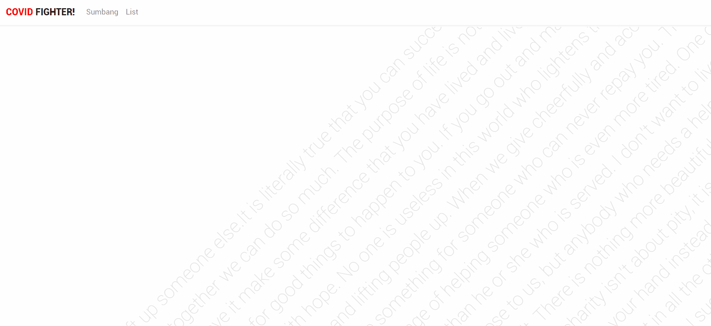

# 『Honorable Mention』

  
Kepadamu

  pejuang kesehatan, penjuang pundak keluarga, dan pejuang pendidikan terima kasih.
  terima kasih untuk bapak munif telah mengajari pelajaran yang sangat berharga, terima kasih orangtua saya yang telah melahirkan saya, terima kasih teman-teman ku di manapun kamu berada :D.
  dan tak lupa terima kasih kepadamu, siapapun itu :D

  
Text di background

  jika anda penasaran dengan text pada background home

maka anda berada di tempat yang tepat, mari kupas HONORABLE MENTION yang berisi quote yang saya kutip pada background

"If you want to lift yourself up, lift up someone else." 
**- Booker T. Washington**

"It is literally true that you can succeed best and quickest by helping others to succeed." 
**-Napoleon Hill**

"Alone we can do so little; together we can do so much." 
**-Helen Keller**

"The purpose of life is not to be happy. It is to be useful, to be honorable, to be compassionate, to have it make some difference that you have lived and lived well." 
**-Ralph Waldo Emerson**

"The best way to not feel hopeless is to get up and do something. Don’t wait for good things to happen to you. If you go out and make some good things happen, you will fill the world with hope, you will fill yourself with hope." 
**-Barack Obama**

"No one is useless in this world who lightens the burdens of another." 
**-Charles Dickens**

"There is no exercise better for the heart than reaching down and lifting people up." 
**-John Holmes**

"When we give cheerfully and accept gratefully, everyone is blessed." 
**-Maya Angelou**

"You have not lived today until you have done something for someone who can never repay you." 
-**John Bunyan**

"The best antidote I know for worry is work. The best cure for weariness is the challenge of helping someone who is even more tired. One of the great ironies of life is this: He or she who serves almost always benefits more than he or she who is served." 
**-Gordon B. Hinckley**, Standing for Something: 10 Neglected Virtues That Will Heal Our Hearts and Homes

"I don't want to live in the kind of world where we don't look out for each other. Not just the people that are close to us, but anybody who needs a helping hand. I cant change the way anybody else thinks, or what they choose to do, but I can do my bit." 
**-charles de lint**

"There is nothing more beautiful than someone who goes out of their way to make life beautiful for others." 
**-Mandy Hale**, *The Single Woman: Life, Love, and a Dash of Sass*

"Love is not patronizing and charity isn't about pity, it is about love. Charity and love are the same -- with charity you give love, so don't just give money but reach out your hand instead." 
**-Mother Teresa**

"I like video games, but they're really violent. I'd like to play a video game where you help the people who were shot in all the other games. It'd be called 'Really Busy Hospital." 
**-Demetri Martin**

"It's not enough to have lived.We should be determined to live for something.May I suggest that it be creating joy for others,sharing what we have for the betterment of personkind,bringing hope to the lost and love to the lonely." 
**-Leo Buscaglia**

"The pretty ones are usually unhappy. They expect everyone to be enamored of their beauty. How can a person be content when their happiness lies in someone else's hands, ready to be crushed at any moment? Ordinary-looking people are far superior, because they are forced to actually work hard to achieve their goals, instead of expecting people to fall all over themselves to help them." 
**-J. Cornell Michel**, *Jordan's Brains: A Zombie Evolution*

"Remember this. Hold on to this. This is the only perfection there is, the perfection of helping others. This is the only thing we can do that has any lasting meaning. This is why we're here. To make each other feel safe." 
**-Andre Agassi**, *Open*

❤️Thank you for being nice people❤️
