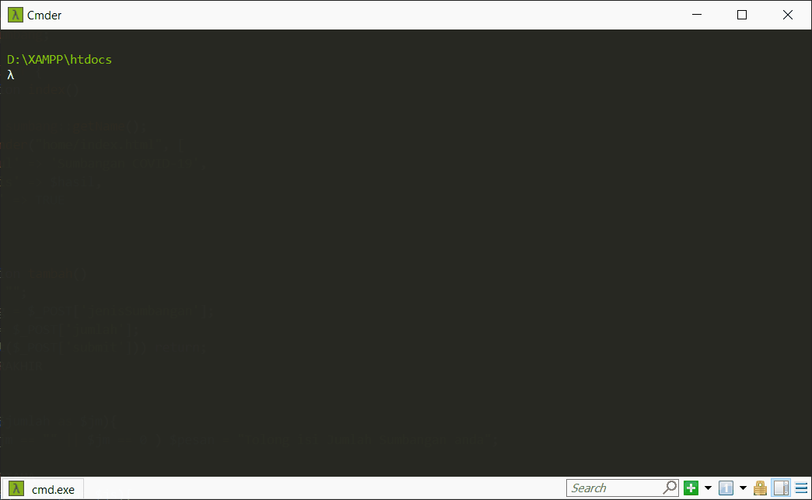
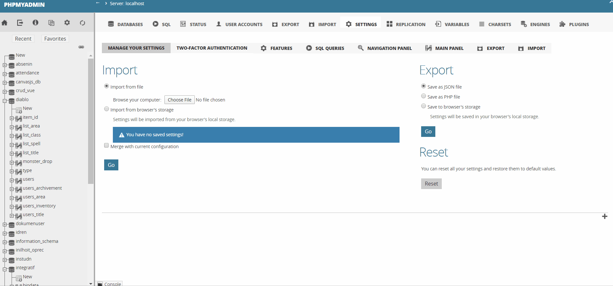

# 
[](https://github.com/peacefulhack)
[](https://symfony.com/) 
[](https://twig.symfony.com/) 


Covid Fighter adalah web yang dikembangakan oleh mikail dengan ❤️, menggunakan twig, php, dengan desain MVC(Model, View, Controller).
<br><br>
*Lihat [MVC](https://www.tutorialspoint.com/mvc_framework/mvc_framework_introduction.htm) untuk mengetahui lebih lanjut.*

# Setup
### Requirement
1. [Composer](https://getcomposer.org/doc/00-intro.md)
2. [Twig](https://twig.symfony.com/doc/3.x/intro.html#installation)
3. [NODE.js](https://nodejs.org/en/download/)
4. Database (saya menggunakan [phpmyadmin 5.0.2](https://www.phpmyadmin.net/downloads/))

### Installation
Download/Clone github ini kedalam komputer anda, anda memerlukan [Twig](https://twig.symfony.com/doc/3.x/intro.html#installation) dan [Composer](https://getcomposer.org/doc/00-intro.md) untuk menggunakan code ini, lalu install dependencies menggunakan [node.js](https://nodejs.org/en/) dengan cara buka CMD (atau aplikasi serupa) anda lalu ketik
```
$ npm install
```

Note: Jika terjadi error, maka re-install NODE.js anda, atau cek [Common Error](https://docs.npmjs.com/common-errors).

### Localization
1. buatlah database baru dengan nama terserah anda (disini saya namakan uas_pi).


2. Lalu Import Tabel kedalam database anda untuk menghindari error, gunakan urutan jenis_sumbangan.sql -> user.sql -> sumbangan.sql karena sumbangan.sql terdapat [foreign key](https://www.tutorialspoint.com/sql/sql-foreign-key.htm) terhadap user dan jenis sumbangan.

3. Bukalah [Constant.php](app/core/Constant.php) didalam folder [core](app/core)
```php
define("BASE_URL", 'http://localhost/2020/uasPI/public');

define("DB_HOST", "localhost");
define("DB_NAME", "integratif");
define("DB_USERNAME", "integratif");
define("DB_PASSWORD", "mWS4Qy0wfXBHU9ec");
```
Lalu ubahlah BASE_URL menjadi url mu sendiri menuju public, karena saya menggunakan [XAMPP](https://www.apachefriends.org/index.html) maka terhitung dari folder htdocs menjadi localhost. Ubah juga DB_HOST menjadi hostingan anda, saya localhost, lalu DB_NAME adalah nama dari database anda, bukan platform database anda. lalu DB_USERNAME dan DB_PASSWORD adalah akun yang anda daftarkan dalam database. cek [users management](https://docs.phpmyadmin.net/en/latest/privileges.html) phpmyadmin.

# Usage
URL dalam website ini berlaku seperti dibawah ini
```
http://localhost/2020/UAS_PemrogramanIntegratif/public/[MAIN URL]/[METHOD]/[PARAMETER]

Main URL terdapat 2 yaitu Home dan Jenis dengan method:

Home/index 		=> Menampilkan form dari Sumbangan
Home/tambah		=> Menambah data dari form sumbangan kedalam database
Jenis/index		=> Menampilkan semua list sumbangan didalam database
Jenis/filter		=> Return blank putih karena tidak ada parameter
Jenis/filter/[id]	=> Menampilkan list sumbangan berdasarkan id
```


# Penjelasan kodingan
### tambah
URL: `Home/tambah`
pertama mengecek apakah method post dari form telah dikirimkan dari home menggunakan `isset`
lalu check isi dari satu persatu, apakah ada yang kosong, jika tidak ada maka `setUser` dimana berisi 
```sql
INSERT INTO `user`( `name`, `gender`) VALUES (:name , :gender)

dimana name dan gender adalah inputan 
user yang di passing kedalam variable
```
lalu mengecheck `isThere` untuk mengecheck apakah jenis yang di inputkan sudah ada atau belum, menggunakan
```sql
SELECT `id` FROM `jenis_sumbangan` WHERE `name`=:jsumbang LIMIT 1

dimana jsumbang adalah jenis sumbangan yang di inputkan user dan 
sql di limit 1 karena kita butuh 1 nama sama atau tidak ada
```
setelah itu, jika ada maka langusng `setSumbangan`, jika tidak ada maka `setJS` atau men-set Jenis sumbangan dulu menggunakan:
```sql
INSERT INTO `jenis_sumbangan`(`name`) VALUES ( :jsumbang )

dengan jsumbang adalah jenis sumbangan yang di input oleh user
```
dan langsung `setSumbangan` menggunakan sql:
```sql
INSERT INTO `sumbangan`(`userid`, `jenis`, `jumlah`) VALUES (:userid , :jenisid , :jumlah)
```

### jenis
URL: `jenis/index`
langsung select name dari jenis sumbangan menggunakan `getName` dan data list sumbangan dengan `getSumbangan`
getname adalah select biasa, sedangkan getSumbangan adalah berikut:
```php
$sql = "SELECT (@cnt := @cnt + 1) AS nomer, b.name,\n"

                    . "b.gender, \n"
                    . "c.name AS jenis, a.jumlah \n"
                    . "FROM `sumbangan` AS a\n"
                    . "CROSS JOIN (SELECT @cnt := 0) AS dummy\n"
                    . "INNER JOIN user AS b ON b.id=a.userid\n"
                    . "INNER JOIN jenis_sumbangan AS c ON c.id=a.jenis\n"
                    . "WHERE 1";


yang dimana maksudnya, mengambil var cnt untuk dijadikan penomoran, karena A_I dalam ID tidak selalu urut,
karena masalah delete atau yang lainnya, lalu INNER JOIN adalah agar user dan jenis_sumbangan nya 
tidak berupa angka tapi berupa nama dimana user.id=sumbangan.userid dan 
jenis_sumbangan.id=sumbangan.id WHERE 1 adalah selalu true, jika WHERE dihapus pun tidak masalah.
```

URL:`jenis/filter/[id]`
hampir sama dengan index dari jenis namun ditambahkan WHERE clause dimana:
```sql
WHERE jenis_sumbangan.id=:name

dan name adalah id dari user, kenapa saya namain name, 
awalnya parameternya berupa name, tapi karena terlalu rawan, saya ganti id.
```

# Framework
1. [Bootstrap 4](https://getbootstrap.com/docs/4.4/getting-started/download/)
2. [Datatable](https://datatables.net/)
3. [Form Validator](https://jqueryvalidation.org/)
4. [Animate On Scroll](https://michalsnik.github.io/aos/)

# Font
1. [Roboto](https://fonts.google.com/specimen/Roboto)
